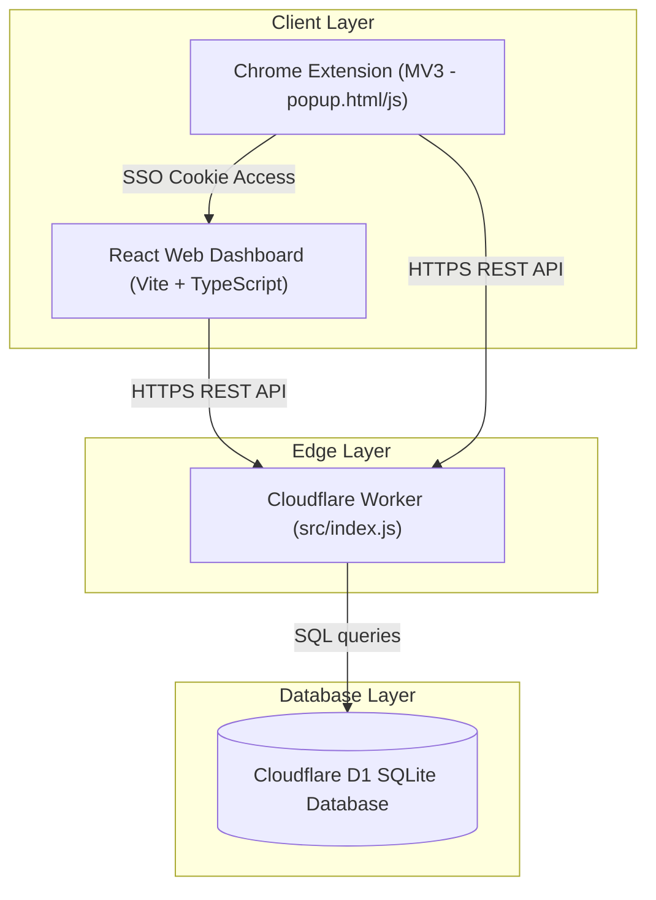

# Technical Specification & Architecture Blueprint: Nexus-571 (Bharath-571-Utils)

This document provides a highly exhaustive, absolute technical blueprint and logical breakdown of the **Nexus-571 Utility Suite**. It captures every architectural layer, database schema, edge API endpoint, Chrome extension service worker, styling paradigm, theme style system, UI micro-animation, and individual tool functionality down to the implementation details.

---

## 1. System Architecture Overview

Nexus-571 is a secure, high-performance web dashboard and extension designed as an edge-optimized serverless monorepo utilizing Cloudflare's ecosystem.



### Key Technical Stack:
*   **Frontend**: React (v18+), TypeScript, Vite, Vanilla CSS + TailwindCSS, Zustand (State Management), Framer Motion (Animations).
*   **Chrome Extension**: Manifest V3, utilizing `chrome.storage.local` and `chrome.cookies` for seamless Single Sign-On (SSO).
*   **Backend Server**: Cloudflare Workers (ES Modules format).
*   **Database**: Cloudflare D1 (Serverless SQL Database based on SQLite).
*   **Authentication**: JWT-based stateless sessions, Google & GitHub OAuth 2.0, PBKDF2 with SHA-256 for password hashing.
*   **Typography**: Google Font "Outfit" (`Outfit:wght@300;400;500;600;700`).

---

## 2. Styling System & Theme Design (CSS Specification)

Nexus-571 features a rich, glassmorphic styling system driven by CSS Custom Properties (`:root` variables) enabling instant runtime theme switching.

### A. Core CSS Design System Tokens
These global variables are overridden dynamically when themes are active:

| Token Name | Default Dark Mode | Light Mode | Naruto Mode | Pokemon Mode | Cyberpunk Mode | Rick & Morty Mode |
| :--- | :--- | :--- | :--- | :--- | :--- | :--- |
| `--bg-dark` | `#0f172a` (Slate-900) | `#f8fafc` (Slate-50) | `#1a0a00` (Deep Orange) | `#0d1b3e` (Navy Blue) | `#0a0014` (Deep Purple) | `#021a07` (Deep Forest) |
| `--bg-sidebar` | `rgba(15, 23, 42, 0.85)`| `rgba(255,255,255,0.85)`| `rgba(30,10,0,0.92)` | `rgba(10,20,55,0.92)` | `rgba(10,0,24,0.92)` | `rgba(2,20,5,0.94)` |
| `--accent-base` | `#14b8a6` (Teal) | `#14b8a6` (Teal) | `#ff6a00` (Ninja Orange) | `#ffcb05` (Pika Yellow) | `#00fff5` (Neon Cyan) | `#00ff41` (Portal Green) |
| `--text-main` | `#f8fafc` (Slate-50) | `#0f172a` (Slate-900) | `#ffe8cc` | `#e8f4ff` | `#e0f7ff` | `#ccffcc` |
| `--text-muted` | `#94a3b8` (Slate-400) | `#64748b` (Slate-500) | `#c8a070` | `#8fb8e8` | `#8ecfdc` | `#55aa66` |
| `--input-bg` | `rgba(15, 23, 42, 0.8)`| `rgba(255,255,255,0.8)`| `rgba(20,8,0,0.85)` | `rgba(10,20,60,0.85)` | `rgba(5,0,20,0.9)` | `rgba(2,12,5,0.9)` |
| `--card-border`| `rgba(255,255,255,0.1)`| `rgba(0,0,0,0.1)` | `rgba(255,120,0,0.2)` | `rgba(255,203,5,0.25)`| `rgba(0,255,255,0.2)` | `rgba(0,255,65,0.18)` |
| `--glow-color` | `rgba(45,212,191,0.3)` | N/A | `rgba(255,106,0,0.3)` | `rgba(255,203,5,0.2)` | `rgba(0,255,245,0.2)` | `rgba(0,255,65,0.2)` |

### B. Glassmorphism Utilities
The signature UI pattern is defined by `.glass` or `.glass-panel`:
```css
.glass {
  background: rgba(30, 41, 59, 0.4);
  backdrop-filter: blur(12px);
  -webkit-backdrop-filter: blur(12px);
  border: 1px solid rgba(255, 255, 255, 0.1);
  box-shadow: 0 4px 6px -1px rgba(0, 0, 0, 0.3);
}
```

### C. Advanced Layout Frameworks
1.  **3D Interactive Grid Perspective**: The dashboard implements mouse-reactive card tilting via `perspective: 1500px` and `transform-style: preserve-3d`. On card hover, elements within the card project outwards:
    *   Icons: `transform: translateZ(40px)`
    *   Titles: `transform: translateZ(30px)`
    *   Pin Buttons: `transform: translateZ(50px)`
2.  **Adaptive Collapsed Sidebar**:
    *   Normal: `width: 280px`
    *   Collapsed: `width: 68px` (hides `.nav-text`, centers `.nav-icon`, disables `.nav-separator`).
3.  **Command Palette Overlay**: Fullscreen layout with high `z-index: [9999]`, blurred backdrop-filter (`backdrop-blur-xl`), and smooth scaling transitions.

---

## 3. High-Fidelity UI Micro-Animations

Nexus-571 uses hardware-accelerated animations (`will-change`, transform transitions) to create an engaging experience:

### A. Cinematic Starry Background
*   **Twinkling Stars (`starTwinkle`)**: Generates randomly sized particle elements.
    ```css
    @keyframes starTwinkle {
      0%, 100% { opacity: var(--twinkle-op, 0.4); transform: scale(1); }
      50% { opacity: 1; transform: scale(1.2); }
    }
    ```
*   **Shooting Stars (`shootingStar`)**: Simulates meteor streaks traveling diagonally across the viewport.
    ```css
    @keyframes shootingStar {
      0% { transform: translateX(0) translateY(0) rotate(-45deg) scale(0); opacity: 0; }
      10% { opacity: 1; transform: translateX(-100px) translateY(100px) rotate(-45deg) scale(1); }
      30% { transform: translateX(-1000px) translateY(1000px) rotate(-45deg) scale(1); opacity: 0; }
    }
    ```
*   **Exploding Particles (`explode`)**: Triggers an explosion on clicking background stars, creating transient expanding ring fragments.

### B. Thematic Float-ups
*   **Float Up (`themeFloatUp`)**: Floating bubbles or symbols rising slowly up the page (`0% { transform: translateY(0) } 100% { transform: translateY(-120vh) }`).
*   **Cloud Drift (`cloudDrift`)**: Pokémon or Rick & Morty portals drifting horizontally across the view (`translateX(0)` to `translateX(150vw)`).
*   **Kunai Rain (`kunaiDrop`)**: Naruto mode features falling kunai blades rotating dynamically.

### C. Authentication Security Transitions
*   **Wrong Password "Bomb Explosion"**:
    *   Card Shaking: A jerky, heavy shake sequence (`authCardShake`) combined with a red/orange border glow flash (`authCardFlash`).
    *   Bomb Emoji: A scaling and rotating overlay emoji (`bombAppear`) exploding from scale 0 to 3 before fading out.
    *   Explosion Particles: Up to 30 custom particle elements initialized at the cursor location, shooting in randomized vectors using standard translation metrics (`--tx`, `--ty`).
*   **Successful Login "Black Hole Vortex"**:
    *   Card Sucking (`cardSuckIn`): Shrinks the authorization container from scale 1 down to 0, adding 90 degrees of rotation and a heavy blur filter (up to `20px`).
    *   Vortex Ring (`ringPulse`): Generates three nested rings that scale outwards rapidly.
    *   Light Rays (`suckRay`): Draws linear vertical gradients converging towards the screen center before dissolving.

---

## 4. Cloudflare Worker Edge Logic & API Routing (`src/index.js`)

The edge service worker routes all `/api/*` endpoints. It integrates D1 database query binding, CORS protection filters, and cryptographic libraries.

### A. Authentication Mechanisms
*   **PBKDF2 Password Hashing**:
    ```js
    const key = await crypto.subtle.deriveKey(
      { name: 'PBKDF2', salt: salt, iterations: 100000, hash: 'SHA-256' },
      keyMaterial,
      { name: 'AES-GCM', length: 256 },
      true,
      ['encrypt', 'decrypt']
    );
    ```
*   **Stateless JWT Signature Verification**: Validates tokens signed with `HS256`. Checks token expiration dates (`exp`) set to a rolling 30-day duration.

### B. API Routing Table

| Method | Endpoint | Authorization | Input Parameters | Database Logic & Execution |
| :--- | :--- | :--- | :--- | :--- |
| **POST** | `/api/auth/register` | Public | `{ username, password }` | Checks table conflicts. Hashes password via PBKDF2. Inserts new row into `users`. Generates JWT & `Set-Cookie` session. |
| **POST** | `/api/auth/login` | Public | `{ username, password }` | Selects `password_hash`. Splices the salt. Compares PBKDF2 hash. If matched, returns session payload. |
| **GET** | `/api/auth/github` | Public | Redirect Redirects client to standard GitHub OAuth 2.0 application authorization gateway. |
| **GET** | `/api/auth/github/callback`| Public | `?code=XYZ` | Exchanges code. Retrieves user profile. Upserts user row prefixed with `github_`. Redirects back to dashboard. |
| **GET** | `/api/auth/google` | Public | Redirect Redirects to Google identity authorization endpoints. |
| **GET** | `/api/auth/google/callback`| Public | `?code=XYZ` | Exchange callback payload. Upserts user prefixed with `google_`. Redirects back to dashboard. |
| **POST** | `/api/auth/update_password`| Required | `{ oldPassword, newPassword }`| Verifies old hash via current DB record. Overwrites with new salted PBKDF2 hash. |
| **GET** | `/api/notes` | Required | None | `SELECT id, content, tags, updated_at FROM notes WHERE user_id = ? ORDER BY updated_at DESC` |
| **POST** | `/api/notes` | Required | `{ id, content, tags }` | `INSERT INTO notes (user_id, id, content, tags) VALUES (?,?,?,?) ON CONFLICT(user_id, id) DO UPDATE SET content=excluded.content, tags=excluded.tags, updated_at=CURRENT_TIMESTAMP` |
| **PATCH** | `/api/notes/:id` | Required | `{ newId }` | Validates duplicate conflict. `UPDATE notes SET id = ?, updated_at = CURRENT_TIMESTAMP WHERE user_id = ? AND id = ?` |
| **DELETE**| `/api/notes/:id` | Required | None | `DELETE FROM notes WHERE user_id = ? AND id = ?` |
| **GET** | `/api/history` | Required | `?tool=json` (Optional) | `SELECT id, tool_id, payload, MAX(created_at) as created_at FROM tool_history WHERE user_id = ? AND tool_id = ? GROUP BY payload ORDER BY created_at DESC LIMIT 50` |
| **POST** | `/api/history` | Required | `{ toolId, payload }` | Deletes existing duplicate logs for clean stack sorting. `INSERT INTO tool_history (user_id, tool_id, payload) VALUES (?, ?, ?)` |
| **DELETE**| `/api/history` | Required | `?tool=json` (Optional) | Truncates tool history logs for one tool or completely sweeps history table records. |
| **GET** | `/api/prefs` | Required | `?key=appMode` | `SELECT value FROM user_prefs WHERE user_id = ? AND key = ?` |
| **POST** | `/api/prefs` | Required | `{ key, value }` | `INSERT INTO user_prefs (user_id, key, value) VALUES (?,?,?) ON CONFLICT(user_id, key) DO UPDATE SET value=excluded.value, updated_at=CURRENT_TIMESTAMP` |
| **GET** | `/api/search` | Required | `?q=searchQuery` | Performs wildcards replacements. Matches (`LIKE %q%`) both notes content, notes tags, and tool history payloads. |

---

## 5. D1 SQL Database Schema

```sql
CREATE TABLE IF NOT EXISTS users (
  id TEXT PRIMARY KEY,
  username TEXT UNIQUE NOT NULL,
  password_hash TEXT NOT NULL,
  created_at DATETIME DEFAULT CURRENT_TIMESTAMP
);

CREATE TABLE IF NOT EXISTS notes (
  user_id TEXT,
  id TEXT,
  content TEXT,
  tags TEXT DEFAULT '',
  updated_at DATETIME DEFAULT CURRENT_TIMESTAMP,
  PRIMARY KEY (user_id, id),
  FOREIGN KEY(user_id) REFERENCES users(id) ON DELETE CASCADE
);

CREATE TABLE IF NOT EXISTS user_prefs (
  user_id TEXT,
  key TEXT,
  value TEXT,
  updated_at DATETIME DEFAULT CURRENT_TIMESTAMP,
  PRIMARY KEY (user_id, key),
  FOREIGN KEY(user_id) REFERENCES users(id) ON DELETE CASCADE
);

CREATE TABLE IF NOT EXISTS tool_history (
  id INTEGER PRIMARY KEY AUTOINCREMENT,
  user_id TEXT DEFAULT 'admin',
  tool_id TEXT,
  payload TEXT,
  created_at DATETIME DEFAULT CURRENT_TIMESTAMP,
  FOREIGN KEY(user_id) REFERENCES users(id) ON DELETE CASCADE
);

CREATE INDEX IF NOT EXISTS idx_tool_history_user_tool ON tool_history(user_id, tool_id);
CREATE INDEX IF NOT EXISTS idx_notes_user_updated ON notes(user_id, updated_at DESC);
```

---

## 6. Chrome Extension Service Core & SSO mechanics

The Google Chrome extension (`manifest.json` using Manifest V3 framework) operates seamlessly across domains:
1.  **Bi-directional SSO Cookie Interception**:
    *   On start, `popup.js` invokes `chrome.storage.local.get` to find any authenticated session token.
    *   If absent, the extension queries active HTTP cookies from the main dashboard worker domain (`https://bharath-571-utils.muppanenibharath571.workers.dev`) using `chrome.cookies.get`.
    *   If a session cookie exists, the extension copies the token value into local storage.
    *   Upon a login event inside the extension popup, `chrome.cookies.set` is called to sync the session to the browser's cookie storage, allowing immediate website login synchronization.
2.  **Inline Processing Tools**:
    The following tools execute inside the extension popup container (`width: 380px`, `max-height: 600px` standard UI frame):
    *   *URL Encoder/Decoder*: Operates via standard `encodeURIComponent` / `decodeURIComponent` logic using a split input-output layout.
    *   *Base64 Converter*: Performs bi-directional encoding via browser-native `btoa()` and `atob()` with strict formatting catch blocks.
    *   *Password Generator*: Selects characters using random indexing over dynamic character arrays (`[a-zA-Z0-9!@#$...]`).
    *   *Text Case Converter*: Applies case changes dynamically with single-click clipboard operations.
    *   *Notepad (Autosave)*: Pulls the user's latest cloud note and starts a 1000ms debounced auto-save function posting changes to `/api/notes`.

---

## 7. Deep Dive: Individual Utility Tools Logic (1 - 36)

Every utility component within `src/components/tools/` features highly specific processing logic:

1.  **JSON Formatter (`JsonFormatter.tsx`)**:
    *   *Logic*: Parses input using `JSON.parse()`. Catches lint errors, tracking precise index positions. Renders recursive JSON tree nodes using custom expandable disclosure elements. Offers formatting indentation widths (2 spaces, 4 spaces, tabs) or complete white-space minification.
2.  **Base64 Converter (`Base64Converter.tsx`)**:
    *   *Logic*: Implements binary file conversions by loading files into a browser-native `FileReader`, translating binary buffers using Uint8Array indexing, and formatting into Base64 Data URLs.
3.  **Image Optimizer (`ImageOptimizer.tsx`)**:
    *   *Logic*: Loads an image into an in-memory `HTMLImageElement`. Instantiates an `HTMLCanvasElement`, scales the canvas to the desired optimized width/height dimensions using bilinear interpolation, and calls `canvas.toBlob()` at custom quality parameters (`0.1` - `1.0`) to convert it into target formats (`image/jpeg`, `image/webp`).
4.  **Hash Generator (`HashGenerator.tsx`)**:
    *   *Logic*: Uses the browser Web Crypto API `crypto.subtle.digest()` for hashing functions (SHA-1, SHA-256, SHA-512) and JS library imports for MD5. Feeds input arrays in blocks to optimize large file streams.
5.  **Unit Converter (`UnitConverter.tsx`)**:
    *   *Logic*: Maps numeric inputs to target standard base formats (e.g., converting all lengths to meters, temperatures to Kelvin, or data sizes to bytes) before applying linear coefficients to the selected output unit.
6.  **Text Case Converter (`TextCaseConverter.tsx`)**:
    *   *Logic*: Utilizes matching regex patterns to slice sentences and apply transformations:
        *   `Title Case`: capitalizes the first character of each word except standard conjunctions.
        *   `camelCase`: lowercases initial character, stripping spaces/dashes, and capitalizing subsequent words.
        *   `snake_case` / `kebab-case`: lowercases text and replaces spaces with underscores/dashes.
7.  **Entity Encoder (`EntityEncoder.tsx`)**:
    *   *Logic*: Bi-directional entity conversion. Replaces unsafe characters with safe HTML entity sequences (e.g. mapping `<` to `&lt;`, `>` to `&gt;`) or translates unicode escapes (`\u003c` to `<`).
8.  **Notepad & Rich Editor (`Notepad.tsx`)**:
    *   *Logic*: Integrates a text editor (Quill/Standard textarea). Interacts with `/api/notes` using a debounced timer. Provides auto-saves, tag management, note filtering, and text exports to PDF or TXT.
9.  **Password Generator (`PasswordGenerator.tsx`)**:
    *   *Logic*: Assembles an array of eligible characters based on checkbox selections (Uppercase, Lowercase, Numbers, Special Symbols). Generates indices using `window.crypto.getRandomValues()` for secure, unguessable password generation.
10. **URL Shortener (`UrlShortener.tsx`)**:
    *   *Logic*: Connects to worker redirect bindings or external micro-API shorteners, saving long URL mappings to short path segments.
11. **Date-Time Formatter (`DateTimeFormatter.tsx`)**:
    *   *Logic*: Leverages JS `Intl.DateTimeFormat` configurations to format time zones. Translates local timestamps to ISO-8601, UTC, RFC-2822, and standard locale representations.
12. **Color Picker (`ColorPicker.tsx`)**:
    *   *Logic*: Accesses standard web Canvas contexts to query absolute pixel HEX values. Provides math functions translating HSL (Hue, Saturation, Lightness) profiles into RGB and CMYK color channels.
13. **JWT Sandbox (`JwtSandbox.tsx`)**:
    *   *Logic*: Splits tokens into Header, Payload, and Signature using the standard dot (`.`) separator. Decodes base64url segments using `atob()`. Validates JWT formatting and checks timestamp expiration statuses in real-time.
14. **cURL Converter (`CurlConverter.tsx`)**:
    *   *Logic*: Uses parser state regexes to extract parameters from cURL command blocks (e.g., parsing `-X`, `-H`, `--data`, `-d`, `--compressed`). Generates code templates in JavaScript (fetch/axios), Python (requests), Go, and PHP.
15. **Cron Generator (`CronGenerator.tsx`)**:
    *   *Logic*: Provides an interactive GUI with sliders and selectors (minutes, hours, days, months, weekdays) that translates inputs into a 5-field cron statement. Evaluates cron strings to print the next 5 execution timestamps.
16. **AI Image Generator (`ImageGenerator.tsx`)**:
    *   *Logic*: Dispatches formatted string parameters to dynamic public image generation engines (such as Pollinations.ai, Picsum, Robohash) and handles loading, rendering, and direct downloads.
17. **Epoch Converter (`EpochConverter.tsx`)**:
    *   *Logic*: Performs epoch conversions. Translates millisecond/second integer timestamps to formatted localized date-time strings, and processes incoming date strings back to raw epoch integers.
18. **JSON ↔ YAML Converter (`JsonYamlConverter.tsx`)**:
    *   *Logic*: Converts data formats using third-party YAML parser libraries (`yaml` or custom micro-parsers) and standard `JSON.stringify` serialization.
19. **Regex Tester (`RegexTester.tsx`)**:
    *   *Logic*: Compiles regular expressions dynamically using `new RegExp()`. Highlights matched substrings inside test containers and provides real-time capture group indices.
20. **Markdown Editor (`MarkdownEditor.tsx`)**:
    *   *Logic*: Split-screen interface using `marked.js` to compile markdown input into HTML structures, styled using custom styling rules.
21. **DB Seed Generator (`MockDataGen.tsx`)**:
    *   *Logic*: Generates fake data records based on configured user schemas (e.g. generating names, addresses, emails, dates) and outputs as JSON arrays, CSV lists, or SQL insertion sheets.
22. **CSV ↔ JSON Converter (`CsvJsonConverter.tsx`)**:
    *   *Logic*: Parses CSV sheets by separating rows (newline characters) and dividing column values (supporting commas, semicolons, tabs), matching columns to JSON keys.
23. **Binary ↔ Hex Converter (`BinaryHexConverter.tsx`)**:
    *   *Logic*: Processes character sequences into character codes, converting numbers to binary representation (`number.toString(2)`) or hexadecimal representation (`number.toString(16)`).
24. **File Type Detector (`FileDetector.tsx`)**:
    *   *Logic*: Reads the first 4 to 12 bytes of uploaded files into an `ArrayBuffer`. Inspects hex patterns (e.g., `89 50 4E 47` for PNG, `25 50 44 46` for PDF) to identify actual formats.
25. **MIME Lookup (`MimeLookup.tsx`)**:
    *   *Logic*: Features a key-value dictionary containing standard file extension mappings and MIME types, allowing fast lookup operations.
26. **Images to PDF (`Img2Pdf.tsx`)**:
    *   *Logic*: Loads multiple image files, resizes them to fit target page parameters (A4 standard dimensions), and creates a downloadable document stream using `jspdf`.
27. **QR Code Generator/Scanner (`QrTool.tsx`)**:
    *   *Logic*: Generates QR codes using canvas rendering libraries. Scans QR codes from uploaded images or camera feeds by analyzing video frame arrays via `jsQR` to parse payloads.
28. **XML ↔ JSON Converter (`XmlJsonConverter.tsx`)**:
    *   *Logic*: Parses XML documents using standard browser `DOMParser()` to traverse nodes recursively, outputting structured JSON trees.
29. **Code Minifier (`CodeMinifier.tsx`)**:
    *   *Logic*: Compresses code blocks using regex patterns to remove comments, strip formatting line breaks, and collapse white space blocks down to single spaces.
30. **JSONPath Extractor (`JsonPathExtractor.tsx`)**:
    *   *Logic*: Resolves query strings against JSON structures using custom selectors to pull matching nodes.
31. **Handlebars Binder (`HandlebarsBinder.tsx`)**:
    *   *Logic*: Compiles Handlebars templates in real-time, injecting custom JSON payloads to render dynamic HTML previews.
32. **OData Builder (`ODataBuilder.tsx`)**:
    *   *Logic*: UI options generator that outputs valid OData query strings by chaining parameters like `$filter`, `$select`, `$expand`, `$orderby`, `$top`, and `$skip`.
33. **QR Batch Export (`QrBatchExport.tsx`)**:
    *   *Logic*: Batch processes a text list (separated by newlines) into individual QR codes, positioning them inside a grid on an exportable multi-page PDF document.
34. **REST API Client (`RestApiClient.tsx`)**:
    *   *Logic*: Lightweight Postman alternative. Uses standard in-browser `fetch()` requests to send HTTP requests with custom verbs, headers, and request bodies.
35. **Crop & Resize (`CropResize.tsx`)**:
    *   *Logic*: Renders dynamic cropping bounds over images in a canvas element, cutting and redrawing selected coordinates onto a new canvas for export.
36. **URL Encoder (`UrlEncoder.tsx`)**:
    *   *Logic*: Percent-encodes or decodes characters for query strings and URL schemes using browser-native URI codecs.

---

## 8. Continuous Integration & Future Extensions
*   **Bi-directional state integrity**: Always ensure that when modifying components, client-side Zustand store actions sync both local extension storage and backend D1 SQL database variables.
*   **Visual Assets and Branding**: All styling modifications must respect CSS variables to maintain visual consistency across all modes (Dark, Light, Naruto, Pokémon, Cyberpunk, and Rick & Morty).
